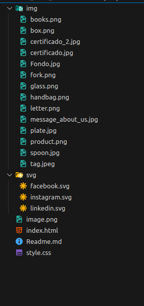

# Entregable Riwi Modulo HTML & CSS
### Coder: Santiago Andrés Comas Durán
### Clan: Caiman
### Correo: santiagocomas07d@gmail.com
### C.C: 1047041927

# Clean tree store
## Resumen
Este es una pagina web estatica (Pensada principalmente para ser dinamica) para comercializar productos construidos con materiales reciclables, es perfecta para encontrar productos amigables con el medio ambiente, esta compuesta por una interfaz pensada para el usuario que ofrece variedad de opciones de interaccion. Ademas, es responsive.

## Estructura de la pagina web.

Estructura:
## header
     navegador (Let's start - about me - products - contact)
##  main
     section - inicio
     section - about me
     section - data
     section - mensaje
     section - productos
     section - contacto
## footer
    div (Facebook - Instagram - linkedin)
    
    
## Contenidod de la pagina
     El proyecto contiene una pagina de inicio con informacion sobre la empresa y datos claves de su recorrido, reconocimientos y referencias en el mercado de productos ecologicos. Hay productos disponible para la venta en la section productos y un formulario de contacto al final de la pagina para contactar a los asesores comerciales de la empresa.

## Imagen de la estructura del proyecto

    
    
        
